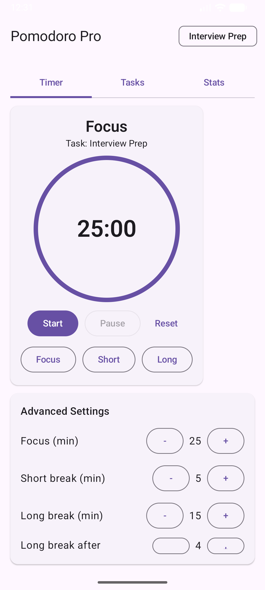
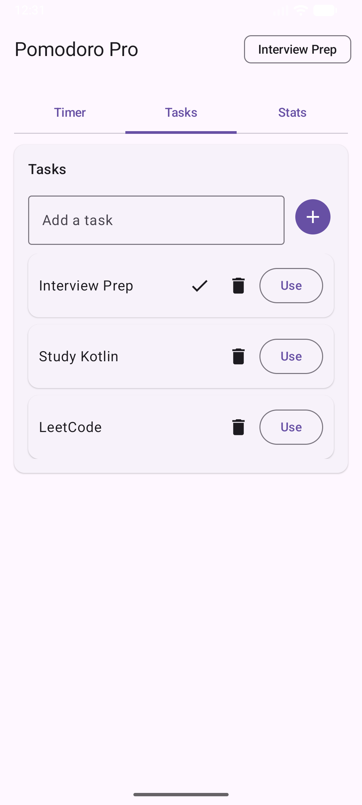

# Pomodoro Timer – Jetpack Compose

A modern Android Pomodoro Timer application built using **Jetpack Compose** and **Material 3**, designed to showcase clean UI architecture, state management, and modern Android development practices.

This project serves as a **portfolio/demo application** for Android roles.

---

## ✨ Features

- Pomodoro focus timer with configurable work and break durations
- Circular progress indicator using Jetpack Compose Canvas
- Start / Pause / Reset timer controls
- Smooth Compose-based UI updates
- Material 3 design system
- Clean single-activity architecture
- Lightweight application with no backend dependency

---

## 🧰 Tech Stack

- **Language:** Kotlin
- **UI Framework:** Jetpack Compose
- **Design System:** Material 3
- **Architecture:** Single-Activity + Composables
- **State Management:** Compose state (`remember`, `mutableStateOf`)
- **Build Tool:** Gradle (Kotlin DSL)

---

## 📱 Screenshots

---

## 🚀 How to Run

1. Open the project in **Android Studio**
2. Allow Gradle sync to complete
3. Run the app on an emulator or physical device  
   *(Minimum API level: 24)*

---

## 🧠 Notes

- The project focuses on **UI composition, state handling, and clean code**
- No backend, network, or authentication dependencies
- Suitable for:
    - Vendor submissions
    - Technical interviews
    - Android portfolio demonstrations

---

## 👤 Author

**Swetha Inampudi**  
Android Developer | Kotlin | Jetpack Compose

